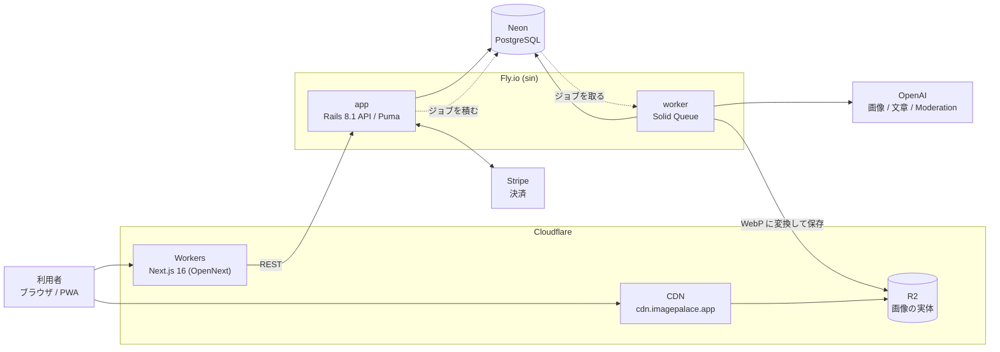
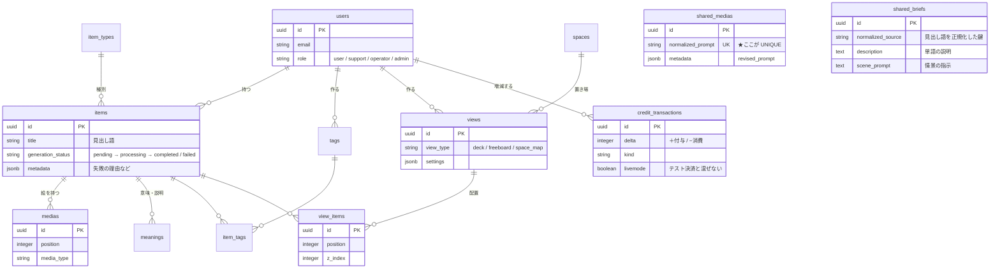

  

  

# ImagePalace

**言葉をイメージに変えて、記憶の宮殿をつくる。**

単語や概念を AI 生成画像に変換し、視覚的に記憶して想起するための学習アプリ。
テキスト中心の学習が合わない人（ビジュアルシンカー）に向けて作りました。

| | |
|---|---|
| URL（α版） | **https://imagepalace.app** |
| お試しコード | **`98C6QBS6`**（30 クレジット＝画像29枚分・先着15名・2026年9月末まで） |
| 稼働状況 | 本番稼働中（Fly.io + Cloudflare Workers） |

> **決済は本番モードなので、注意してください。**
> 動作確認に必要なクレジットは、無料付与および上のお試しコードをお使いください
> （約1クレジットで画像1枚）。
>
> お試しクレジットプレゼントのキャンペーンコードを上記に記載しておきます。
> 登録後に入力いただけたら、少しクレジットが追加されます。

---

## アプリ概要

言葉を AI がイメージ画像に変換し、カードとして集めて活用できる学習サービスです。
テキストでは覚えにくい知識を、必要な瞬間に思い出せる形に変えます。

画像を作って終わりにせず、**作ったイメージを学習資産として蓄積し、組み替えて使えます。**

- 言葉や概念から、イメージ付きのカードを作る
- 意味・説明などの情報も自動生成し、Wikipedia の記述と突き合わせて補える
- カードは、まとまり・関係図・空間マップなど、目的に応じた構造で整理できる
- 同じカードを複数の構造に置ける。一度作った知識を、文脈ごとに組み替えて使える
- 眺めるだけでなく、クイズや反復練習で「思い出す」ところまで扱える

多くのノートアプリが記録・整理を中心とするのに対し、ImagePalace では
「思い出すためのイメージ」を体験の中心に置いています。

同一の正規化プロンプトでは画像を重複生成せず、生成済みの画像を共有して再利用します。
画像生成 API の重複コストを抑えるための設計です。

## 試し方

1. https://imagepalace.app で登録（Google ログインも可）
2. 市街 → デルフォイ → **「キャンペーンコードの受け取り」** から `98C6QBS6` を入力する（30 クレジット）
3. カード作成画面で覚えたい単語を入力する（改行・カンマ区切りでまとめて入力できます）
4. 生成は非同期です。数十秒で画像が届きます

> 既定の設定では、カードのプロパティも少量のクレジットを使って自動生成します。

## 技術構成

- 言語：
  - Ruby 3.3.10 / TypeScript 5 / JavaScript / SQL / HTML / CSS

- フレームワーク・UI：
  - Next.js 16（App Router） / React 19
  - Ruby on Rails 8.1（APIモード）
  - Tailwind CSS v4 / shadcn/ui

- DB・ストレージ：
  - PostgreSQL / Neon（マネージドPostgreSQL）
  - Cloudflare R2 / Active Storage

- インフラ・CI/CD：
  - Fly.io（バックエンド。app と worker の2プロセス構成）
  - Cloudflare Workers（フロントエンド。OpenNext経由） / Cloudflare CDN
  - Docker / GitHub Actions

- 外部API・サービス：
  - OpenAI API（画像生成 gpt-image-1 / 文章生成 GPT-4o / Moderation）
  - Stripe（課金） / Wikipedia API / Sentry / Google Analytics 4

- 認証・セキュリティ：
  - Devise + devise_token_auth（トークン認証）
  - Google OAuth 2.0 / Sign in with Apple
  - TOTP二要素認証 / WebAuthn・Passkey / Rack::Attack

- 主要ライブラリ・機能技術：
  - Zustand（状態管理）
  - Three.js・React Three Fiber（3D表現） / React Flow（ノードグラフ） / dnd-kit（空間配置）
  - Solid Queue（非同期ジョブ） / libvips（画像最適化）

- テスト・品質管理：
  - RSpec / Vitest / RuboCop / ESLint / Brakeman・bundler-audit

> 実装済み・実装中のもの：Sign in with Apple、
> fal.ai（FLUX。画像生成の代替プロバイダー。既定は OpenAI）。

## 構成

キューを PostgreSQL に置いているため、Redis を持たずに非同期処理ができます（Solid Queue）。
生成は worker が担い、Web を止めません。アプリを DB と同じリージョンに置いているのは、
往復の本数がそのまま待ち時間になっていたためです（[performance-history](docs/performance-history.md)）。

## データモデル（中核）

76 テーブルのうち、学習体験の中心にあるものだけを抜き出しています。

このアプリの要は `shared_medias.normalized_prompt` の UNIQUE 制約です。
同一の正規化プロンプトでは画像を重複生成せず、生成済みの画像を共有して再利用します。
画像生成 API の重複コストを抑えるための設計で、その代わりに
「同じ見出し語で複数の案を並べて選ぶ」ことはできません。

`shared_medias` と `shared_briefs` に外部キーはありません。
利用者のカードから伸びる線ではなく、正規化した文字列を鍵に引く共有の置き場だからです
（`shared_briefs` は「単語 → 説明文 → 情景」の2段階生成の中間物で、これも語ごとに再利用します）。
図で線を引かずに独立させているのは、そのためです。

## 設計で考えたこと

### 当初の想定から変えたこと

着手前の計画（[docs/concept.md](docs/concept.md)）から、実際に動かして変えた判断です。

| 項目 | 当初の想定 | 実際の採用 | 変更理由 |
|-----|----------|----------|--------|
| ジョブキュー | Redis | Solid Queue | Rails 8 標準で PostgreSQL をキューに使える。**運用対象を1つ減らせた** |
| バックエンドのホスト | Render | Fly.io | リージョンを選べるため。DB（Neon）の隣へ寄せて **DB往復 70.2ms → 2.4ms**（実測） |
| ストレージ | AWS S3 | Cloudflare R2 | S3互換のまま転送（egress）無料。画像配信が主用途なので差が大きい |

### 意思決定ログ（ADR）

判断の背景・検討した選択肢・トレードオフを、決めた時点で残しています。

| ドキュメント | 内容 |
|---|---|
| [infra-backend](docs/decisions/infra-backend.md) | バックエンドインフラ選定 |
| [frontend-deploy](docs/decisions/frontend-deploy.md) | フロントエンドのデプロイ先選定 |
| [image-storage](docs/decisions/image-storage.md) | ストレージ・CDN 戦略 |
| [image-upload-security](docs/decisions/image-upload-security.md) | 画像アップロードの多層防御（libvips の任意コード実行対策） |
| [image-retry-limits](docs/decisions/image-retry-limits.md) | 失敗した画像の作り直しに、種類と上限を置く |
| [oauth-design](docs/decisions/oauth-design.md) | OAuth 認証設計（単一テーブル vs 分離） |
| [credit-model](docs/decisions/credit-model.md) | クレジットモデル（期限付きグラント + Free→Paid 引き継ぎ） |
| [credit-period-design](docs/decisions/credit-period-design.md) | クレジットの周期・更新日 |
| [db-advisory-locks](docs/decisions/db-advisory-locks.md) | 本番マイグレーションのアドバイザリロック無効化 |
| [semantic-search](docs/decisions/semantic-search.md) | 意味検索（pgvector + OpenAI） |
| [space-mapping-design](docs/decisions/space-mapping-design.md) | 空間（ロード／ルーム）とビューの設計 |

構成の全体像は [docs/architecture.md](docs/architecture.md)、機能仕様は [docs/spec.md](docs/spec.md) にあります。

### 残っている課題

- 認証トークンを localStorage に保持しており、CSP に `'unsafe-inline'` が残っている
  （判断の経緯は `frontend/src/lib/security/csp.ts` に記載）
- Rack::Attack のカウンタがプロセスローカル。単一インスタンス構成では整合するが、
  スケールアウト時は差し替えが必要

## 開発の始め方

手元で動かす手順と、変わりやすい情報の正本の在り処は
[docs/development.md](docs/development.md) にまとめています。

## AI の活用

開発では、設計検討・実装・調査・レビューの補助に生成 AI を活用しています。
提案や生成コードは内容を確認し、テストと CI を通したうえで採用しています。

このアプリでは、当時の状況も鑑み、**AI の活用そのものも積極的な練習の対象としました。**
当時のハーネスエンジニアリングのベストプラクティスをできる限り調査し、
自分なりに skills・hooks などを組み立てて運用しています（git 管理化は予定）。

組み立てたものの例:

- **skills** — 目的別の作業手順（機能実装・レビュー・テスト作成・デプロイ・セキュリティ検査など）を
  用意し、毎回ゼロから指示を書かずに済むようにする
- **hooks** — 秘密情報がコマンドや差分に混ざったときに、その場で止める
- **rules** — コミット規約・テスト方針・セキュリティ規則・git ワークフローを、参照される形で明文化する
- **CI** — 本番と同じ production ターゲットのイメージで RuboCop と RSpec を回す（`.github/workflows/`）。
  `REQUIRE_VIPS=1` を置き、依存が欠けたときにテストが黙ってスキップされないようにしている

任せ方は、**範囲を切って渡し、受け入れ基準は自分が持つ。** この分け方にしています。
実装そのものは大きな単位で任せる一方、何を作るか・どこまでで完成とするか・
何を捨てるかは自分で決め、テストと CI を通してからマージします。
判断の背景は PR 本文と意思決定ログ（`docs/decisions/`）に残し、後から辿れるようにしています。

## ライセンス

**閲覧・評価目的で公開しています。利用許諾は行っていません（無断利用・再配布不可）。**

## 企画・背景

着手前〜MVP リリース時点に書いた README は [docs/concept.md](docs/concept.md) に残しています。

