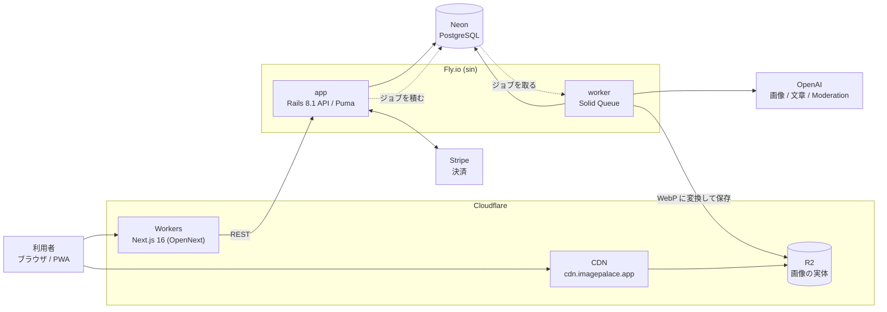

<p align="center">
  
</p>

# ImagePalace

**言葉をイメージに変えて、記憶の宮殿をつくる。**

単語や概念を AI 生成画像に変換し、視覚的に記憶して想起するための学習アプリ。
テキスト中心の学習が合わない人（ビジュアルシンカー）に向けて作りました。

| | |
|---|---|
| デモ | **https://imagepalace.app** |
| お試しコード | `<公開時に発行して差し替え>`（登録後、クレジット画面から引き換え） |
| 稼働状況 | 本番稼働中（Fly.io + Cloudflare Workers） |

> **決済は本番モードです。購入フローは試さないでください。**
> 動作確認に必要なクレジットは、上のお試しコードで足ります。

---

## これは何か

覚えたい単語を入力すると、その意味に沿った画像が生成され、カードとして手元に残ります。
カードは棚に並べたり、盤面に配置したり、線でつないだりできます。

**「保存できること」と「思い出せること」は違う** という考えが出発点です。
既存のノートアプリは記録に強い一方、想起のための設計はされていません。
このアプリは、イメージを補助ではなく**前提**として組み込んでいます。

同じ単語の画像は世界で1枚だけ生成し、以後は使い回します（`shared_medias.normalized_prompt` に UNIQUE 制約）。
これは体験の都合ではなく、**画像生成 API のコストが事業を壊さないようにするための設計**です。

## 試し方

1. https://imagepalace.app で登録（Google ログインも可）
2. クレジット画面で、上のお試しコードを引き換える
3. カード作成画面で覚えたい単語を入力する（改行・カンマ区切りでまとめて入力できます）
4. 生成は非同期です。数十秒で画像が届きます

## 技術構成

- 言語：
  - Ruby 3.3.10 / TypeScript 5 / JavaScript / SQL / HTML / CSS

- フレームワーク・UI：
  - Next.js 16（App Router） / React 19
  - Ruby on Rails 8.1（APIモード）
  - Tailwind CSS v4 / shadcn/ui

- DB・ストレージ：
  - PostgreSQL / Neon（マネージドPostgreSQL）
  - Cloudflare R2 / Active Storage

- インフラ・CI/CD：
  - Fly.io（バックエンド。app と worker の2プロセス構成）
  - Cloudflare Workers（フロントエンド。OpenNext経由） / Cloudflare CDN
  - Docker / GitHub Actions

- 外部API・サービス：
  - OpenAI API（画像生成 gpt-image-1 / 文章生成 GPT-4o / Moderation）
  - Stripe（課金） / Wikipedia API / Sentry / Google Analytics 4

- 認証・セキュリティ：
  - Devise + devise_token_auth（トークン認証）
  - Google OAuth 2.0 / Sign in with Apple
  - TOTP二要素認証 / WebAuthn・Passkey / Rack::Attack

- 主要ライブラリ・機能技術：
  - Zustand（状態管理）
  - Three.js・React Three Fiber（3D表現） / React Flow（ノードグラフ） / dnd-kit（空間配置）
  - Solid Queue（非同期ジョブ） / libvips（画像最適化）

- テスト・品質管理：
  - RSpec / Vitest / RuboCop / ESLint / Brakeman・bundler-audit

> 実装はあるが既定では動かないもの：Sign in with Apple、Google Analytics 4、
> fal.ai（FLUX。画像生成の代替プロバイダー。既定は OpenAI）。
> いずれも環境変数の設定で有効になる。

## 構成



**キューを PostgreSQL に置いている**ので、Redis を持たずに非同期処理ができます（Solid Queue）。
生成は worker が担い、Web を止めません。アプリを DB と同じリージョンに置いているのは、
往復の本数がそのまま待ち時間になっていたためです（[performance-history](docs/performance-history.md)）。

## データモデル（中核）

76 テーブルのうち、学習体験の中心にあるものだけを抜き出しています。


**`shared_medias.normalized_prompt` の UNIQUE 制約がこのアプリの要**です。
同じ単語の画像は世界で1枚しか生成せず、以後は全員がそれを使い回します。
体験の都合ではなく、画像生成 API のコストが利用者数に比例して増えないようにするための設計です。
その代わり「同じ単語で複数案を並べる」ことは原理的にできません。

`shared_medias` と `shared_briefs` に**外部キーはありません**。
利用者のカードから伸びる線ではなく、**正規化した文字列を鍵に引く共有の置き場**だからです
（`shared_briefs` は「単語 → 説明文 → 情景」の2段階生成の中間物で、これも語ごとに使い回します）。
図で線を引かずに独立させているのは、そのためです。

## 設計で考えたこと

### 当初の想定から変えたこと

着手前の計画（[docs/concept.md](docs/concept.md)）から、実際に動かして変えた判断です。

| 項目 | 当初の想定 | 実際の採用 | 変更理由 |
|-----|----------|----------|--------|
| ジョブキュー | Redis | Solid Queue | Rails 8 標準で PostgreSQL をキューに使える。**運用対象を1つ減らせた** |
| バックエンドのホスト | Render | Fly.io | リージョンを選べるため。DB（Neon）の隣へ寄せて **DB往復 70.2ms → 2.4ms**（実測） |
| ストレージ | AWS S3 | Cloudflare R2 | S3互換のまま転送（egress）無料。画像配信が主用途なので差が大きい |

### 意思決定ログ（ADR）

判断の背景・検討した選択肢・トレードオフを、決めた時点で残しています。

| ドキュメント | 内容 |
|---|---|
| [infra-backend](docs/decisions/infra-backend.md) | バックエンドインフラ選定 |
| [frontend-deploy](docs/decisions/frontend-deploy.md) | フロントエンドのデプロイ先選定 |
| [image-storage](docs/decisions/image-storage.md) | ストレージ・CDN 戦略 |
| [image-upload-security](docs/decisions/image-upload-security.md) | 画像アップロードの多層防御（libvips の任意コード実行対策） |
| [image-retry-limits](docs/decisions/image-retry-limits.md) | 失敗した画像の作り直しに、種類と上限を置く |
| [oauth-design](docs/decisions/oauth-design.md) | OAuth 認証設計（単一テーブル vs 分離） |
| [credit-model](docs/decisions/credit-model.md) | クレジットモデル（期限付きグラント + Free→Paid 引き継ぎ） |
| [credit-period-design](docs/decisions/credit-period-design.md) | クレジットの周期・更新日 |
| [db-advisory-locks](docs/decisions/db-advisory-locks.md) | 本番マイグレーションのアドバイザリロック無効化 |
| [semantic-search](docs/decisions/semantic-search.md) | 意味検索（pgvector + OpenAI） |
| [space-mapping-design](docs/decisions/space-mapping-design.md) | 空間（ロード／ルーム）とビューの設計 |

構成の全体像は [docs/architecture.md](docs/architecture.md)、機能仕様は [docs/spec.md](docs/spec.md) にあります。

### 分かっているトレードオフ

隠さずに書いておきます。いずれも理由があって、いまはこの形にしています。

- 認証トークンを localStorage に置き、CSP に `'unsafe-inline'` が残っている
  （`frontend/src/lib/security/csp.ts` に判断の経緯を記載）
- Rack::Attack のカウンタがプロセスローカル。単一インスタンス構成では整合するが、
  スケールアウト時は差し替えが要る

## 開発の始め方

```bash
docker compose up          # backend: 3001 / frontend: 3000 / PostgreSQL
```

backend（コンテナの中で実行する）:

```bash
docker compose exec web bundle exec rails db:migrate
docker compose exec web bundle exec rspec
docker compose exec web bundle exec rubocop
```

frontend（`frontend/` で実行する）:

```bash
npm run dev
npm run test
npm run type-check
npm run lint
```

### この README に書かないもの

変わりやすい情報は、**コードや自動生成できるものを正本**にする。
README に写すと、必ず食い違う（実際に一度そうなった）。

| 知りたいこと | 見る場所 |
|---|---|
| API エンドポイントの一覧 | `bundle exec rails routes` |
| 依存パッケージとその版 | `backend/Gemfile.lock` / `frontend/package.json` |
| テーブル・カラム | `backend/db/schema.rb` |
| 原価の単価・付与量などの設定値 | 実装の定数（`CostParameter::DEFAULTS` 等）と運営画面 |

この README には、サービス概要・現在の主要技術・基本構成・開発の始め方と、
公開して差し支えない設計の考え方までを置く。
運用事情（本番の台数・鍵の状態・障害の記録）は含めない。


## AI の使い方について

このアプリは、開発にも AI を使っています。隠さずに書きます。

- **設計・技術選定・レビューの判断は自分**が行い、実装と調査に AI を使いました
- 使い方は自分でルール化しています（コミット規約・テスト方針・セキュリティ規則）。
  生成されたコードも**テストと CI を通してからマージ**する運用です
- 履歴の一部のコミットに `Co-Authored-By` が残っています。後から消していません

判断の跡はコミットと PR の本文に残してあります。
「なぜそうしたか」「なぜそうしなかったか」を読んでいただくのが、一番早い説明になると思います。

## ライセンス

**閲覧・評価目的で公開しています。利用許諾は行っていません（無断利用・再配布不可）。**

同梱している画像はすべて自作（AI 生成）です。

## 企画・背景

着手前に書いた企画書を [docs/concept.md](docs/concept.md) に残しています。
誰のどんな課題を、なぜこの形で解こうとしたのかを書いたものです。

